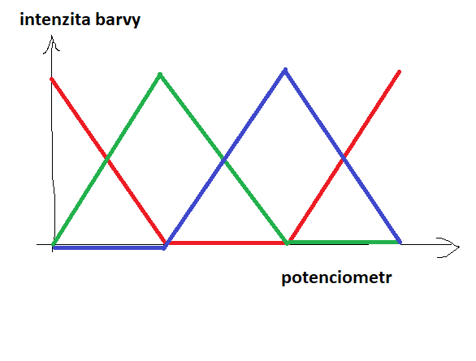

# PIC16F1508 Project
- Programování mikrokontroleru PIC16F1508 v **Assembly** v rámci předmětu Architektura Počítačů.
- Cílem předmětu je se seznámit s současným stavem počítačové architektury na různých úrovních abstrakce.
- Náplň svičení jsou Principy programování ve strojovém kódu, instrukční soubor mikrořadičů PIC a jednotlivé úlohy na programování paměti a periferií.

# PIC16F1508 Microchip


### Documentation
- [Datasheet](https://ww1.microchip.com/downloads/en/DeviceDoc/40001609E.pdf)
- [Instruction set](docs/Podklady-PIC16-1.pdf)

## Ukol

- Pomocí Potenciometru 1 plynule nastavujte barvu RGB LED (R-G-B-R) a pomocí Potenciometru 2 její jas. 


## IDE
- MPlabX ver. 5.35. Linux
- *Note that v5.35 is the last version to support using assembly directly, as opposed to embedded within C code*
- To run the project on your machine (Linux, Windows) Dowload the official software from [microchip.com](https://www.microchip.com/en-us/tools-resources/archives/mplab-ecosystem)

## Code
```assembly

;Uloha_26.asm
;Pomocí P1 plynule nastavujte barvu RGB LED (R-G-B-R) a pomocí P2 její jas
;Zaklad pro psani vlastnich programu
    list	p=16F1508
    #include    "p16f1508.inc"

#define LED1 PWM1DCH
#define LED2 PWM2DCH
#define LED3 PWM3DCH

    
    __CONFIG _CONFIG1, _FOSC_INTOSC & _WDTE_OFF & _PWRTE_OFF & _MCLRE_ON & _CP_OFF & _BOREN_OFF & _CLKOUTEN_OFF & _IESO_OFF & _FCMEN_OFF

    __CONFIG _CONFIG2, _WRT_OFF & _STVREN_ON & _BORV_LO & _LPBOR_OFF & _LVP_ON


;VARIABLE DEFINITIONS
;COMMON RAM 0x70 to 0x7F
    CBLOCK	0x70
	temp
	temp2
	range
	LED1_ON
	LED2_ON
	LED3_ON
	prevP1_H	
	prevP1_L
	prevP2_H
	prevP2_L
	red
	green
	blue
	
	
    ENDC
    
;**********************************************************************
	ORG     0x00
  	goto    Start
	
	ORG     0x04
	nop			;pripraveno pro obsluhu preruseni
  	retfie
	
Start	
	movlb	.1		;Bank1
	movlw	b'01101000'	;4MHz Medium
	movwf	OSCCON		;nastaveni hodin

	call	Config_IOs	;vola nastaveni pinu
	
	
	;config AD Prevodniku
	movlb .1
	movlw	b'00101000'	;P2 = AN10
	movwf	ADCON0
	movlw	b'01110000'	;leftAlig, FRC, VDD
	movwf	ADCON1
	clrf	ADCON2		;single conv.
	bsf	ADCON0,ADON	;zapnout ADC
	
	;config TMR2
	movlb	.0		;Banka0 s TMR2
	clrf	T2CON		;1:1 pre, 1:1 post prescalor
	clrf	TMR2		;vynulovat citac na 0 postscalor
	movlw	0xFF		;(4000000/4)/256 = 3906.25 Hz	pro oko neviditelne
	movwf	PR2		;nastavit na max. hodnotu
	bsf	T2CON,TMR2ON	;po nastaveni vseho zapnout TMR2
	
	;config PWM3! ne PWM1
	movlb	.12		;PWM moduly v Bance 12
	clrf	PWM3DCH
	clrf	PWM3DCL
	bsf	PWM3CON,PWM3OE	;povolit vystup signalu na pin (Output enable)
	bsf	PWM3CON,PWM3EN	;spustit PWM3
	;config PWM1
	clrf	PWM1DCH
	clrf	PWM1DCL
	bsf	PWM1CON,PWM1OE	;povolit vystup signalu na pin (Output enable)
	bsf	PWM1CON,PWM1EN	;spustit PWM1
	;config PWM2
	clrf	PWM2DCH
	clrf	PWM2DCL
	bsf	PWM2CON,PWM2OE	;povolit vystup signalu na pin (Output enable)
	bsf	PWM2CON,PWM2EN	;spustit PWM1
	
	;neprime adresovani
	movlw   0x06       ; Adresa PWM3DH = 0x0612
	movwf   FSR0H      
	movlw   0x18
	movwf   FSR0L      ; Control PWM3DCH ;ovlada vykon a svit
	movlb	.0		;Banka0 s PORT
			
Loop	;Hlavni smycka 
	;Read P1 and P2	
	;Barva = Potenciometer 1
	call	ReadP1	;PRecte Potenciometr 1 a vysledek ulozi do prevP1_H a prevP1_L
	;call	MapToRGB ;Preved 10-bit vysledek ADC na 8-bit.
	call	SetRGB	;Nastav barvu dle rozsahu Potenciometru
	
	;Jas = Potenciometer 2 
	call    ReadP2
	call	setBrightness;Nastav Jas dle hodnoty prevP2_H u zapnut�ch LED
	
	goto    Loop

ReadP1
	;start ADC prevodniku
	
	movlb	.1		;Banka1 s ADC
	movlw	b'00011001'	;P1 = AN6
	movwf	ADCON0		;nastav cteni z P1
	bsf     ADCON0,GO       ;start A/D prevodu
        btfsc   ADCON0,GO 	;A/D prevod skoncen?
        goto    $-1             ;pokud ne, navrat o radek vyse
	
	;10-bit binary result via successive approximation and stores the conversion result into the
	;ADC result registers (ADRESH:ADRESL register pair).
	movf    ADRESH,W
	movwf	prevP1_H ;uloz horn�ch 8 bit? do prevP1_H
	
	movf	ADRESL,W
	movwf	prevP1_L ;uloz spodn� 2 bity do prevP1_L
	
	return
ReadP2
	movlb	.1		;Banka1 s ADC
	movlw    b'00101001'    ;P2 = AN10
	movwf	ADCON0
	bsf     ADCON0,GO       ;start A/D prevodu
        btfsc   ADCON0,GO 	;A/D prevod skoncen?
        goto    $-1             ;pokud ne, navrat o radek vyse
	
	movf    ADRESH,W
	movwf	prevP2_H
	movf    ADRESH,W
	movwf	prevP2_L
	return

MapToRGB
	; 10bitovou hodnotu na 8bitovou (0-255) pro jednoduchost
	movf    prevP1_H,W
	movwf   temp
	rrf	temp,F
	movwf   prevP1_L
	movf    temp,W
	rrf	temp,F
	movwf   prevP1_H
	;8bitovou hodnotu je v prevP1_H a prevP1_L
	
	return
	
SetRGB
	movlb	.12 ;Banka 12 ss PWM
	
	movf	prevP1_H,W
	movwf	temp
	
	; Rozd?len� hodnoty z potenciometru 1 na ctyri casti(256/4) = 64
	movlw	.64
	movwf	range
   
	movf	prevP1_H,W
	subwf	range,W
	btfsc	STATUS,C
	goto	Section1
	
	;Green range
	movf	prevP1_H,W
	addwf	range,W
	btfss	STATUS,C
	goto	Section2
	
	;Blue range
	goto	Section3

Section1
	;Turn on / off LED var
	bcf	LED2_ON,0
	bsf	LED3_ON,0;blue vypnuto
	bcf	LED1_ON,0
	
	movf	temp,W
	subwf	range,W
	
	movwf	red
	movwf	PWM1DCH
	
	subwf	range,W
	movwf	green
	movwf	PWM2DCH
	
	;Blue vypnuto
	clrf	blue
	clrf	PWM3DCH
	clrf	PWM3DCL
	
	return
	
Section2
	;Turn on / off LED var
	bcf	LED2_ON,0
	bcf	LED3_ON,0
	bsf	LED1_ON,0
	movf	temp,W
	subwf	range,W
	
	sublw	.84
	movwf	temp2 ; Ulo?en� do?asn� hodnoty

	; Line�rn� zv�?en� hodnoty blue
	movlw	.84
	subwf	temp2,W
	movwf	blue
	movwf	PWM3DCH
	
	; Line�rn� sn�?en� hodnoty green
	movf	temp,W
	sublw	.64
	movwf	temp
	movlw	.128
	subwf	temp,W
	movwf	green
	movwf	PWM2DCH
	
	;Red vypnutu
	clrf	red
	clrf	PWM1DCH
	clrf	PWM1DCL
	
	return
Section3
	;Turn on / off LED var
	bsf	LED2_ON,0
	bcf	LED3_ON,0
	bcf	LED1_ON,0
	;Line�rn� zvyseni hodnoty red
	movf	temp,W
	sublw	.85
	subwf	range,W
	movlw	.190
	subwf	temp,W
	movwf	red
	movwf	PWM1DCH
	
	; Line�rn� snizeni hodnoty blue
	movf	temp,W
	sublw	.64
	movwf	temp
	sublw	.128
	subwf	temp,W
	movwf	blue
	movwf	PWM3DCH
	;Green
	clrf	green
	clrf	PWM2DCH
	clrf	PWM2DCL
	return

setBrightness
	movlb	.12 ;Banka 12 ss PWM
	movf	prevP2_H,W ;Hornich 8 bit z P2
	
	btfss	LED3_ON,0;If LED3 is ON
	movwf	PWM3DCH; Write to PWM3DCH
	;incf	FSR0L, F ; Increment FSR0L
	
	;opakuj pro ostatni PWM
	btfss	LED2_ON,0
	movwf	PWM2DCH
	;incf	FSR0L,F
	
	btfss	LED1_ON,0
	movwf	PWM1DCH
	;incf	FSR0L,F
	return
	
	
   #include	"Config_IOs.inc"
		
	END


```
## Images

- Working solution...


